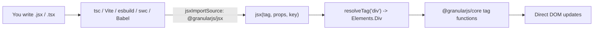

# @granularjs/jsx

> **Optional** automatic JSX runtime for [`@granularjs/core`](../granular). Lets you write `.jsx` / `.tsx` files that compile straight to Granular tag function calls — no Virtual DOM, no extra runtime overhead, no changes to the core.

`@granularjs/jsx` is **strictly opt-in**. The Granular core itself is unchanged: tag functions (`Div`, `Span`, `Button`, ...) remain the canonical, official API. This package exists only for teams who prefer JSX syntax (typically because they are migrating from React, or they value the editor tooling that JSX brings).

If you never install `@granularjs/jsx`, nothing changes for your Granular project.

---

## Why JSX?

You can ship 100% Granular with the tag functions:

```js
import { Div, Span, Button } from '@granularjs/core';

const App = () => Div({ class: 'box' }, Span('hi'), Button({ onClick: doIt }, 'go'));
```

If you prefer JSX (familiar to React/Solid/Preact developers, easier autocomplete in some editors, single-file template-style components), with this package you can write the exact same component as:

```jsx
const App = () => (
  <div class="box">
    <span>hi</span>
    <button onClick={doIt}>go</button>
  </div>
);
```

…and it compiles to the **same** Granular tag function calls under the hood.

---

## How it works

This is the **automatic JSX runtime** (the modern mode used by React 17+, Solid, Preact, Qwik). Your bundler / TS compiler injects an import to `@granularjs/jsx/jsx-runtime` per file and emits `jsx(tag, props, key)` / `jsxs(...)` / `Fragment` calls. The runtime in this package translates them to Granular tag functions.



There is **no Babel plugin to install** in user-land. The classic `@granularjs/babel-plugin-jsx` is no longer maintained (and was never necessary once the automatic runtime existed).

---

## Installation

```bash
npm install --save-dev @granularjs/jsx
# or
pnpm add -D @granularjs/jsx
```

`@granularjs/core` is a `peerDependency`. Install it (or keep the version you already have).

---

## Setup per bundler

### TypeScript (tsc, ts-node, no bundler)

In `tsconfig.json`:

```json
{
  "compilerOptions": {
    "jsx": "react-jsx",
    "jsxImportSource": "@granularjs/jsx"
  }
}
```

For dev mode (better source maps and richer error messages):

```json
{
  "compilerOptions": {
    "jsx": "react-jsxdev",
    "jsxImportSource": "@granularjs/jsx"
  }
}
```

That's the entire setup. `tsc` will emit `import { jsx } from '@granularjs/jsx/jsx-runtime'` for every `.tsx` file automatically.

### Vite

Vite uses esbuild internally and reads `tsconfig.json`. The `tsconfig.json` snippet above is enough — **do not** install `@vitejs/plugin-react`.

If you do not use TypeScript, set the runtime in `vite.config.js`:

```js
import { defineConfig } from 'vite';

export default defineConfig({
  esbuild: {
    jsx: 'automatic',
    jsxImportSource: '@granularjs/jsx',
  },
});
```

### esbuild (standalone)

```js
import { build } from 'esbuild';

await build({
  entryPoints: ['src/main.jsx'],
  bundle: true,
  outfile: 'dist/bundle.js',
  jsx: 'automatic',
  jsxImportSource: '@granularjs/jsx',
});
```

### swc

In `.swcrc`:

```json
{
  "jsc": {
    "parser": { "syntax": "ecmascript", "jsx": true },
    "transform": {
      "react": {
        "runtime": "automatic",
        "importSource": "@granularjs/jsx"
      }
    }
  }
}
```

### Babel (only if you can't use any of the above)

```bash
npm install --save-dev @babel/preset-react
```

```js
// babel.config.js
module.exports = {
  presets: [
    ['@babel/preset-react', {
      runtime: 'automatic',
      importSource: '@granularjs/jsx',
    }],
  ],
};
```

---

## Mapping rules (JSX → Granular)

| JSX                                              | Becomes                                                                |
|--------------------------------------------------|------------------------------------------------------------------------|
| `<div className="x">y</div>`                     | `Div({ class: 'x' }, 'y')`                                             |
| `<label htmlFor="name">Name</label>`             | `Label({ htmlFor: 'name' }, 'Name')` (core writes `for=`)              |
| `<>a<>...</>` (Fragment)                         | An array of children that the parent flattens                          |
| `<MyComp foo={1}/>` (PascalCase)                 | `MyComp({ foo: 1 })` — your function component is called               |
| `<my-card title="a">x</my-card>` (kebab-case)    | A custom element with that exact tag name                              |
| `<option value="1">A</option>`                   | `HtmlOption({ value: '1' }, 'A')` — automatic globals collision fix    |
| `<input disabled />`                             | `Input({ disabled: true })`                                            |
| `<div {...rest}/>`                               | `Div({ ...rest })`                                                     |
| `<div ref={mySignal}/>`                          | After mount, `mySignal` is set to the DOM element                      |
| `<div ref={(el) => { ... }}/>`                   | After mount, the callback is invoked with the DOM element              |
| `<div dangerouslySetInnerHTML={{ __html }} />`   | `Div({ innerHTML: __html })` — React-compat shortcut                   |
| `{count}` (where `count` is a `signal`/`state`)  | The reactive source is passed as a child; Granular updates the DOM     |
| `{cond && <X/>}`                                 | Renders `<X/>` only when truthy at compile time of the JSX expression  |

---

## Reactive children — important

Unlike React, Granular does not re-render components when state changes. If you want a value to update reactively, **pass the source itself**, not its current value.

```jsx
import { signal } from '@granularjs/core';
const count = signal(0);

const Counter = () => (
  <button onClick={() => count.set(count.get() + 1)}>
    Clicked {count} times       {/* count is the signal — DOM updates automatically */}
  </button>
);
```

If you write `{count.get()}` you get a one-time read.

---

## Reactive conditionals

`{cond && ...}` only evaluates once, at the time the JSX tree is built. For reactive show/hide, use `when` from `@granularjs/core`:

```jsx
import { when, signal } from '@granularjs/core';
const open = signal(false);

const Panel = () => (
  <div>
    {when(open, () => <section>visible</section>, () => <span>hidden</span>)}
  </div>
);
```

The `granular migrate` command (from [`@granularjs/cli`](https://www.npmjs.com/package/@granularjs/cli)) converts most React-style `{cond && <X/>}` into `when(cond, () => <X/>)` automatically when `cond` is detected as reactive.

---

## Reactive lists

For dynamic / reactive arrays, use `list` from `@granularjs/core` instead of `Array.prototype.map`:

```jsx
import { list, signal } from '@granularjs/core';
const todos = signal([{ id: 1, text: 'a' }]);

const Todos = () => (
  <ul>
    {list(todos, (todo) => <li>{todo.text}</li>, { key: (t) => t.id })}
  </ul>
);
```

The codemod converts `arr.map((x) => <Row key={x.id}/>)` into `list(arr, (x) => <Row/>, { key })`.

---

## TypeScript support

Full `JSX.IntrinsicElements` typings are bundled. Props are typed as `Reactive<T>` (so they accept `T` or any `Signal<T>`/`State<T>`/`Computed<T>`). Custom-element tag names (anything containing `-`) typecheck as a permissive `HTMLAttributes` bag.

```tsx
import { signal } from '@granularjs/core';

const count = signal(0);

const App = () => <button disabled={count}>{count}</button>;
//                                ^ Reactive<boolean> — would type-error if not bool/source
```

---

## Caveats

- **`{cond && <X/>}` is NOT reactive by itself.** Use `when()` for reactive branching.
- **`arr.map(...)` is NOT reactive.** Use `list()` for reactive lists.
- **Reads in JSX expressions stay as-is.** `{count}` passes the *source*; `{count.get()}` reads the value once.
- **Custom elements** (kebab-case) are supported via the `ElementNode` constructor; they share the same DOM-update rules as built-in tags.
- This package adds **about 1 KB minified** to your bundle. The core does not change in size.

---

## License

Apache-2.0. Same as `@granularjs/core`.
